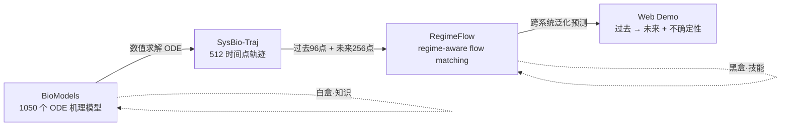

# RegimeFlow 汇报材料（讲稿 + 流程图）

> 用途：给老师汇报时用。一页讲稿 + 一张流程图，可直接截图进 PPT。

---

## 一、流程图（汇报开场放这张）

```
        ① 数据来源            ② 数据生成              ③ AI 训练                  ④ 推理 / 展示
    ┌──────────────┐     ┌──────────────┐     ┌────────────────────┐     ┌──────────────────┐
    │   BioModels   │     │ SysBio-Traj  │     │     RegimeFlow     │     │     Web Demo      │
    │ 1050 个 ODE   │────▶│  仿真轨迹     │────▶│  regime-aware      │────▶│  过去 96 点        │
    │ 机理模型      │     │  512 时间点   │     │  flow matching     │     │  → 未来 256 点     │
    └──────────────┘     └──────────────┘     └────────────────────┘     └──────────────────┘
      白盒 · 知识          数据 · 样本           黑盒 · 技能               演示 · 成果
```

同一张图用 Mermaid 版（VSCode / GitHub / Typora 可直接渲染）：



---

## 二、方法原理（4 个核心组件，讲方法时用）

| # | 组件 | 一句话说明 |
|---|---|---|
| ① | **Regime 分类** | 把生物宏观行为分成稳定 / 振荡 / 单调三类，作为条件 C 注入模型 |
| ② | **Regime-Aware Prior（核心创新）** | 用贝叶斯线性回归 + 每类 regime 专属基函数（指数衰减 / 傅里叶 / 多项式），构造"长得像生物轨迹"的初始分布，**替代标准高斯噪声** |
| ③ | **Conditional Flow Matching** | 学一个向量场 v，把先验样本一步步"推"到目标轨迹（直线插值 + ODE 积分） |
| ④ | **Mamba Backbone + AdaLN** | 线性复杂度状态空间模型处理长序列；每层用自适应层归一化注入 regime 条件 |

---

## 三、一页讲稿（口述口径，约 60 秒）

**定位（一句话）**
> RegimeFlow 是一个"regime 感知的轨迹预测框架"——用 **一个** 训练好的 AI 模型，就能预测 1000 多个生物系统的未来动态，并且对没见过的新系统也能泛化。

**背景 / 痛点**
> 生物系统极其多样，传统做法是每个系统单独写 ODE 方程、单独标定参数，费时费力。现有机器学习方法要么只能单系统、要么只给点预测、没有不确定性。我们的思路是：与其为每个系统建模，不如让一个模型学会"生物动力学"的共性规律。

**数据**
> 我们从 BioModels 数据库收集 1050 个 ODE 机理模型（物种数从 1 到 1000），数值求解得到轨迹，构建了 SysBio-Traj 基准。每个系统 512 个时间点，切分为"过去 96 点（输入）+ 未来 256 点（预测目标）"。

**方法（挑重点说）**
> 关键创新是 **regime-aware prior**：生物系统虽然千差万别，但宏观行为就几类——稳定、振荡、单调。我们不是从高斯噪声开始生成，而是用贝叶斯线性回归 + 每类 regime 的基函数，构造一个"已经像生物轨迹"的初始分布，再用 conditional flow matching 把它逐步推到目标。理论上能证明这降低了传输距离（Wasserstein-2），让学习更容易。

**结果（报数字）**
> 相比 baseline：**MAE 降低 31%**，不确定性校准 **CRPS 改善 17%**，并且能跨系统泛化。

**Demo（现场演示）**
> 网页上左侧是 1050 个生物模型（按通路/分类组织），点一个模型 → 给模型看过去 96 点 → 它预测未来 256 点 → 图上橙色是预测、灰色虚线是真实值，可以直接对比。

---

## 四、可能被追问的点（提前想好答案）

| 追问 | 建议回答 |
|---|---|
| "置信带怎么来的？" | 当前 demo 是**单次采样**，阴影带是相对信号幅度的 **±20% 参考带**，不是统计预测区间；完整版可以做多采样取经验分位数 |
| "为什么不用 Transformer？" | 生物轨迹长、样本多，Mamba 是线性复杂度，长序列推理更高效 |
| "能预测没见过的系统吗？" | 能，这是核心卖点——跨系统泛化，训练时留了 unseen 系统做测试 |
| "ODE 方程去哪了？" | 模型不接触方程，只学"过去序列 → 未来序列"的映射，所以新系统不需要重新写方程 |
